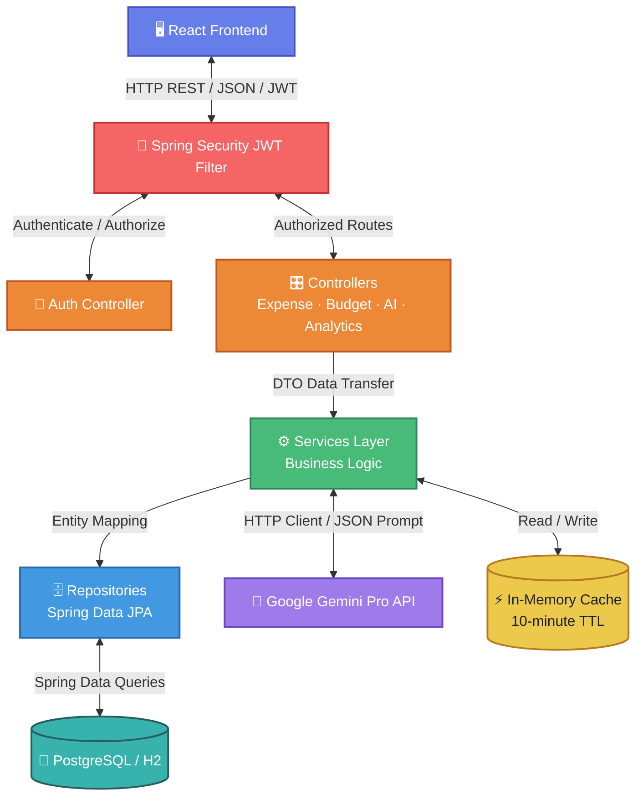
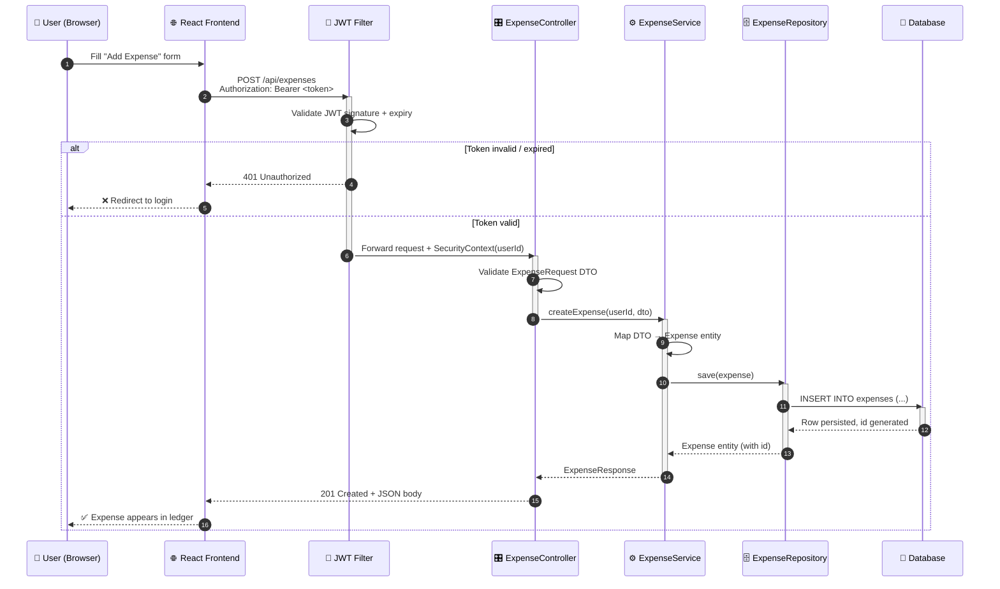
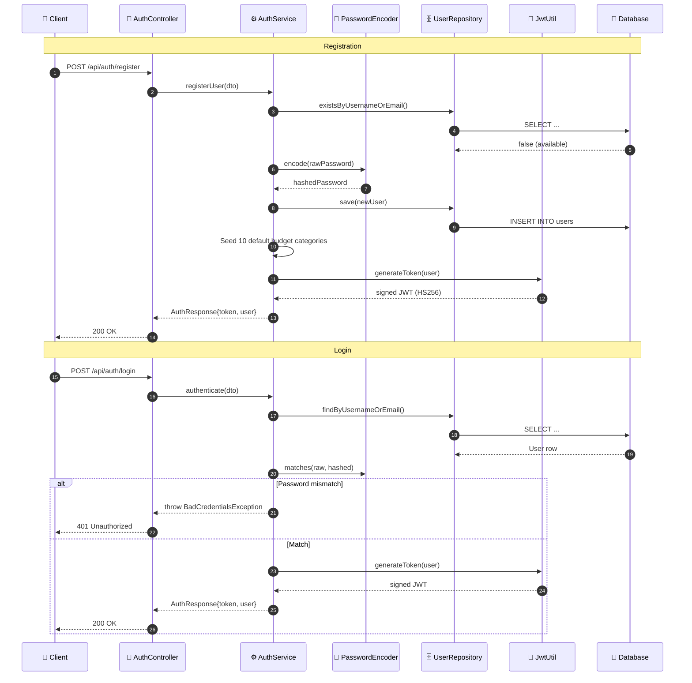
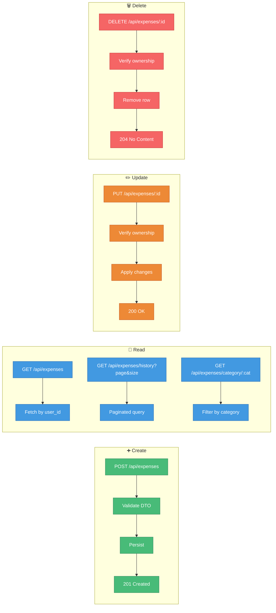
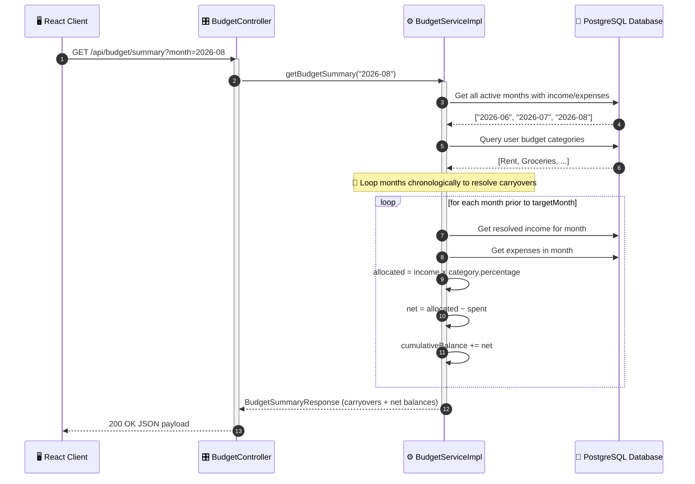
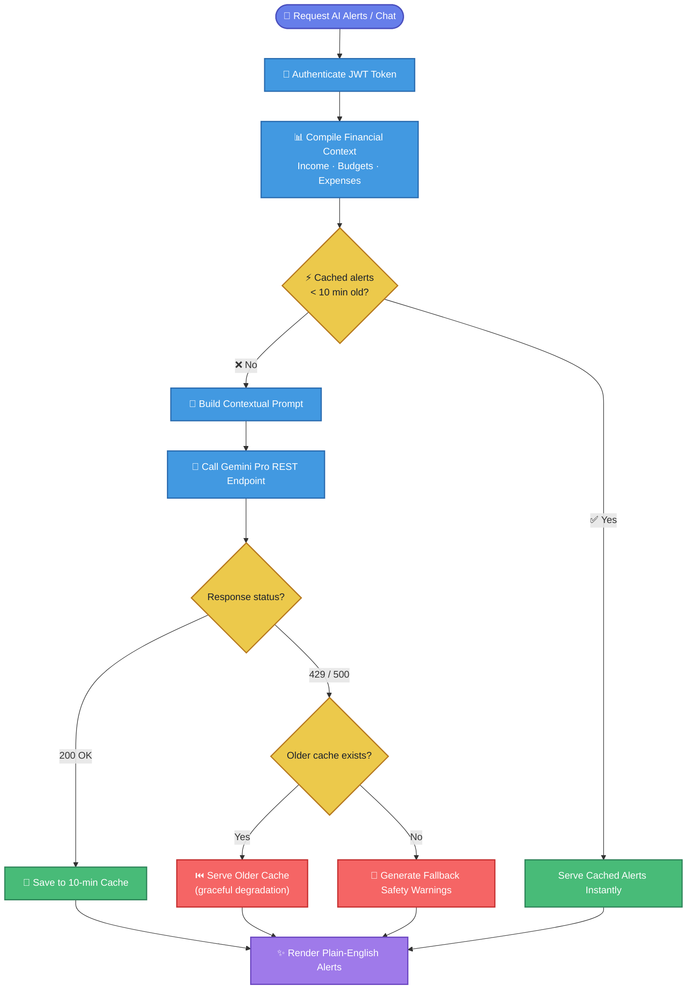
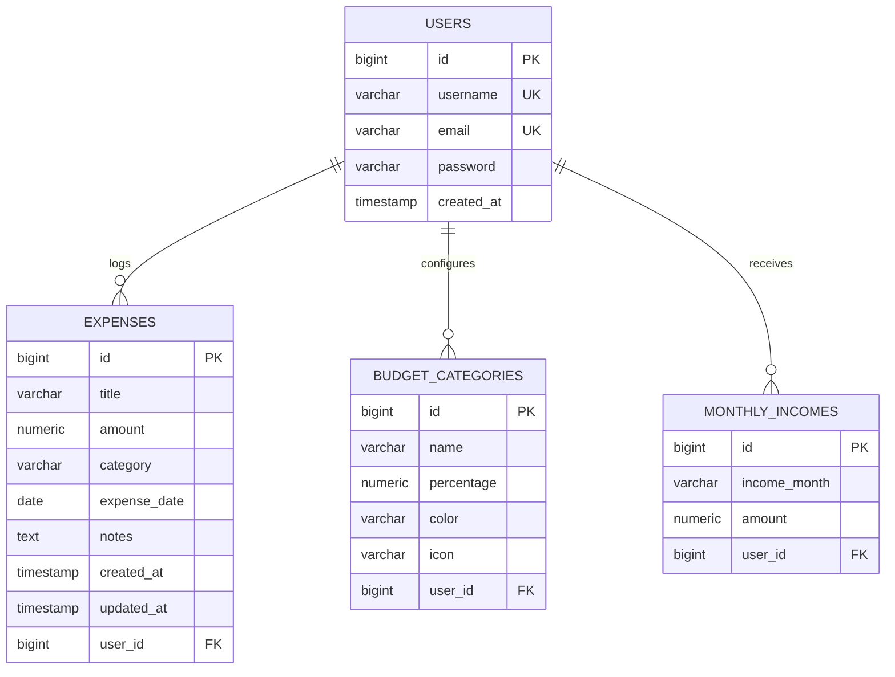

<div align="center">


<a href="https://openjdk.org/"></a>
<a href="https://spring.io/projects/spring-boot"></a>
<a href="https://www.postgresql.org/"></a>
<a href="https://personal-expence-tracker-backend.onrender.com"></a>


</div>

> ⚠️ **Note on "animation":** the banner and typing-text lines above are real animated SVGs generated live by two external, community-run services (`capsule-render`, `readme-typing-svg`) — not a GitHub-native feature. If either service ever goes offline or changes its URL scheme, those specific images (not the rest of the README) will simply stop rendering. Everything else below — the diagrams — is standard GitHub-native **Mermaid**, which renders crisp and interactive-feeling (pan/zoom, clickable in the GitHub UI) but is not frame-animated.

---

## 📚 Table of Contents

- [System Architecture](#-system-architecture)
- [Request Lifecycle (Full Trace)](#-request-lifecycle-full-trace)
- [Authentication Flow](#-authentication-flow)
- [Expense CRUD Flow](#-expense-ledger-crud-flow)
- [Budget Rollover Workflow](#-multi-month-carry-over--budget-rollover-workflow)
- [Gemini AI Pipeline](#-secure-gemini-ai-prediction-pipeline-with-quota-fallback)
- [Database Schema (ER Diagram)](#-database-schema)
- [Technology Stack](#️-technology-stack)
- [API Specification](#-endpoint-api-specification)
- [Local Installation](#-local-installation--configuration)
- [Production Deployment](#️-production-deployment-on-render)
- [AI Prompt Engineering](#-gemini-ai-prompt-engineering-details)

---

## 🏗 System Architecture

Layered Controller → Service → Repository pattern, color-coded by responsibility:



---

## 🔁 Request Lifecycle (Full Trace)

How one authenticated `POST /api/expenses` call travels through every layer:



---

## 🪪 Authentication Flow



---

## 💸 Expense Ledger CRUD Flow



---

## 📆 Multi-Month Carry-over & Budget Rollover Workflow



---

## 🤖 Secure Gemini AI Prediction Pipeline with Quota Fallback



---

## 💾 Database Schema



### 🔑 Unique Constraints

| Table | Constraint Name | Enforced Columns | Purpose |
| :--- | :--- | :--- | :--- |
| `users` | `idx_users_username` | `username` | Enforces unique login usernames. |
| `users` | `idx_users_email` | `email` | Prevents registration with duplicate emails. |
| `budget_categories` | `uc_user_category_name` | `user_id, name` | Restricts a user from having duplicate category names. |
| `monthly_incomes` | `uc_user_month` | `user_id, income_month` | Enforces a single salary record per month. |

---

## 🛠️ Technology Stack

| Layer | Technology |
| :--- | :--- |
| 🧩 Runtime | Java Development Kit (JDK) 17 |
| 🌱 Framework | Spring Boot 3.2.5 (Spring MVC, Spring Security, Spring Data JPA) |
| 🔐 Auth & Security | JSON Web Tokens (JWT) with HS256 algorithm |
| 🗄️ Data Access | Spring Data JPA (Hibernate ORM) |
| 💻 Dev Database | H2 In-Memory/File Database (PostgreSQL mode) |
| 🐘 Prod Database | Deployed PostgreSQL instance |
| 📦 JSON Processing | Jackson ObjectMapper, Spring Web clients |
| 📖 API Docs | OpenAPI 3 / Swagger UI (`springdoc-openapi`) |

---

## 🔗 Endpoint API Specification

All paths are relative to `http://localhost:8080` (Development) or `https://personal-expence-tracker-backend.onrender.com` (Production). Protected routes require the header `Authorization: Bearer <TOKEN>`.

### 1️⃣ Authentication Services (`/api/auth`)
| Method | Path | Description | Access | Request Body | Response |
| :--- | :--- | :--- | :--- | :--- | :--- |
| **POST** | `/register` | Create a new user profile & seed default categories | Public | `RegisterRequest` | `AuthResponse` |
| **POST** | `/login` | Authenticate username/email and password | Public | `LoginRequest` | `AuthResponse` |

### 2️⃣ Expense Ledger Services (`/api/expenses`)
| Method | Path | Description | Access | Parameters | Response |
| :--- | :--- | :--- | :--- | :--- | :--- |
| **GET** | `/` | Fetch all expenses logged by the user | Protected | None | `List<ExpenseResponse>` |
| **GET** | `/history` | Paginated server-side ledger list | Protected | `page`, `size` | `Page<ExpenseResponse>` |
| **POST** | `/` | Log a new transaction expense | Protected | `ExpenseRequest` | `ExpenseResponse` |
| **PUT** | `/{id}` | Edit an existing transaction by ID | Protected | `ExpenseRequest` (Path `id`) | `ExpenseResponse` |
| **DELETE** | `/{id}` | Permanently delete a transaction | Protected | Path `id` | `204 No Content` |
| **GET** | `/category/{category}` | Fetch expenses matching a category string | Protected | Path `category` | `List<ExpenseResponse>` |

### 3️⃣ Budget Envelope Services (`/api/budget`)
| Method | Path | Description | Access | Parameters / Body | Response |
| :--- | :--- | :--- | :--- | :--- | :--- |
| **POST** | `/income` | Log/Update monthly salary | Protected | `MonthlyIncomeRequest` | `MonthlyIncomeResponse` |
| **GET** | `/income` | Fetch income for a target month | Protected | Query `month` (YYYY-MM) | `MonthlyIncomeResponse` |
| **GET** | `/categories` | Fetch category envelope details | Protected | None | `List<BudgetCategoryResponse>` |
| **POST** | `/categories` | Create custom budget category | Protected | `BudgetCategoryRequest` | `BudgetCategoryResponse` |
| **PUT** | `/categories/{id}` | Edit category configurations | Protected | `BudgetCategoryRequest` | `BudgetCategoryResponse` |
| **DELETE** | `/categories/{id}` | Remove a budget category envelope | Protected | Path `id` | `204 No Content` |
| **POST** | `/categories/reset` | Reset all categories to default 10 | Protected | None | `List<BudgetCategoryResponse>` |
| **GET** | `/summary` | Retrieve monthly rollover report | Protected | Query `month` (YYYY-MM) | `BudgetSummaryResponse` |

### 4️⃣ Gemini AI Consulting Services (`/api/ai`)
| Method | Path | Description | Access | Request Body | Response |
| :--- | :--- | :--- | :--- | :--- | :--- |
| **GET** | `/alerts` | Get 2-3 predictive plain-English budget warnings | Protected | None | `List<String>` |
| **POST** | `/chat` | Chat live with the AI Financial Advisor | Protected | `AiChatRequest` | `AiChatResponse` |

---

## 🚀 Local Installation & Configuration

### Prerequisites
* **Java SDK 17** (or above) installed and configured on your path.
* **Apache Maven 3.8+** installed.
* **Git** command line client.

### Step 1 — Clone the Repository
```bash
git clone https://github.com/ashrithBalaji456/Personal_Expence_Tracker_Backend.git
cd Personal_Expence_Tracker_Backend
```

### Step 2 — Configure System Properties
Create a file named `src/main/resources/application.properties` (or edit the existing one):
```properties
# Server port config
server.port=8080

# H2 File Database configuration (Local storage)
spring.datasource.url=jdbc:h2:file:./data/trackerdb;DB_CLOSE_DELAY=-1;MODE=PostgreSQL
spring.datasource.username=sa
spring.datasource.password=
spring.jpa.hibernate.ddl-auto=update
spring.jpa.show-sql=true

# Security Configuration
app.jwt.secret=YOUR_TACTILE_SECRET_KEY_MINIMUM_256_BITS_FOR_SECURE_HMAC_SIGNATURES
app.jwt.expiration-ms=86400000

# Gemini API configuration
gemini.api.key=YOUR_GOOGLE_AI_STUDIO_API_KEY
```

> [!IMPORTANT]
> Keep your **Google AI Studio API Key** private. Never commit the raw key to GitHub. Use system environment variables `GEMINI_API_KEY` in production.

### Step 3 — Run the Application
```bash
mvn clean compile
mvn spring-boot:run
```
The server will boot up and bind to `http://localhost:8080`.

---

## ☁️ Production Deployment on Render

### Deploying using Docker


The project includes a multi-stage production build `Dockerfile`. Render detects the Dockerfile and automatically builds the container environment:

```dockerfile
# Stage 1: Build the Maven packages
FROM maven:3.8.4-openjdk-17 AS build
WORKDIR /app
COPY pom.xml .
COPY src ./src
RUN mvn clean package -DskipTests

# Stage 2: Create execution container
FROM openjdk:17-jdk-slim
WORKDIR /app
COPY --from=build /app/target/*.jar app.jar
EXPOSE 8080
ENTRYPOINT ["java", "-jar", "app.jar"]
```

### Step-by-Step Render Deployment Guide
1. Log into your [Render Dashboard](https://dashboard.render.com).
2. Click **New +** and select **Web Service**.
3. Link your GitHub repository `https://github.com/ashrithBalaji456/Personal_Expence_Tracker_Backend`.
4. Configure the Web Service settings:
   * **Runtime**: `Docker`
   * **Build Command**: Render handles this via the Dockerfile.
   * **Instance Type**: `Free`
5. Go to the **Environment** tab and add your secrets:
   * `DB_URL`: The URL to your PostgreSQL instance (e.g. `jdbc:postgresql://<host>:<port>/<dbname>`).
   * `DB_USERNAME`: Database username.
   * `DB_PASSWORD`: Database password.
   * `JWT_SECRET`: A secure randomly generated string.
   * `GEMINI_API_KEY`: Your private Google AI Studio API key.
6. Click **Deploy Web Service**. Render will build the container and deploy the app live!

---

## 🤖 Gemini AI Prompt Engineering Details

To keep interactions readable and useful for every user, the backend utilizes custom system instructions when interfacing with the Gemini Pro API:

### 1. Alert Prompt
```text
You are a friendly Budgeting Assistant. Review the user's monthly limits and actual spending:
{Context: Category allocations, Spent amounts, Remaining limits}

Generate exactly 2-3 short, helpful bullet alerts about their spending rules:
1. Use simple, everyday English. Do NOT use terms like 'velocity', 'leverage', or complex jargon.
2. Carefully verify the 'Spent' value for each category. If Spent is 0, they have not spent anything yet. Do NOT warn about overspending in categories with 0 spent. Instead, suggest keeping it that way or congratulate them.
3. Keep each alert short and simple (under 15 words).
4. Do NOT write any introduction or greetings. Just output the bullets.
```

### 2. Chat Prompt
```text
You are a friendly, professional Personal Financial Advisor. Use the following user financial details to answer their query.
{Context: Live ledger overview, category balances, income carry-overs}

Guidelines for your response:
1. Use simple, plain English that is easy to understand. Do NOT use difficult financial terms or complex jargon (avoid words like velocity, projections, amortization, leverage, etc.).
2. Double check the values in the context: 'Spent' is what they have actually spent, and 'Remaining' is what is left. If Spent is 0, they have not spent any money yet. Do not confuse Spent with Remaining or Limit.
3. Provide clear, encouraging, and highly structured advice.

User Query: {UserMessage}
```

---

<div align="center">

</div>
